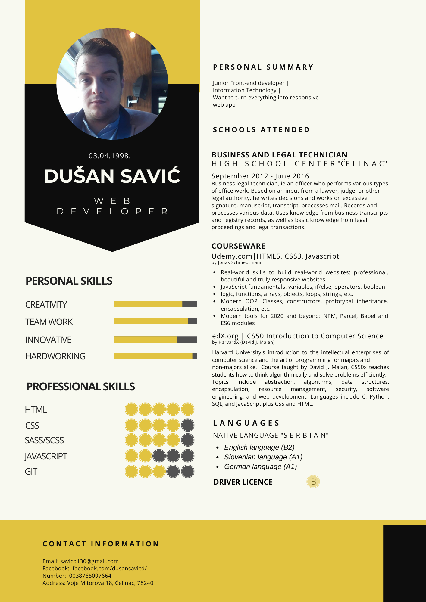

<h2>About</h2>

`“Continuous effort - not strength or intelligence - is the key to unlocking our potential.”` 
Winston Churchill

I'm self-taught Software developer, with novice experience in building and maintaining responsive websites.

Technologies that I have studied are HTML, CSS, Sass, Git/Github and Javascript. I focused my studding on vanilla Javascript, including ES6 features.

My goal is to improve my knowledge of learning new things and stronger basics. I am inspired by all possibilities of front-end technologies and interested to explore and learn further. 

My scope of knowledge covers:

`HTML5 | CSS3 | Sass/Scss | Javascript | Jquery | GIT/GitHub`

<h2>Resume</h2>

